# ROS Wall Scanner

A ROS-based wall scanner system for detecting electrical wires, water pipes, and wall studs using electromagnetic and capacitive sensing.


## System Architecture

```mermaid
graph TB
    %% Styling
    classDef hardware fill:#FF6B6B,stroke:#D63031,stroke-width:2px,color:#fff
    classDef sensor fill:#74B9FF,stroke:#0984E3,stroke-width:2px,color:#fff
    classDef processing fill:#00B894,stroke:#00A085,stroke-width:2px,color:#fff
    classDef output fill:#FDCB6E,stroke:#E17055,stroke-width:2px,color:#000
    classDef control fill:#6C5CE7,stroke:#5F3DC4,stroke-width:2px,color:#fff
    classDef topic fill:#A29BFE,stroke:#6C5CE7,stroke-width:1px,color:#fff
    classDef message fill:#FD79A8,stroke:#E84393,stroke-width:1px,color:#fff

    %% Hardware Layer
    subgraph HW ["🔧 Hardware Layer"]
        COIL[("Inductive Coil<br/>+ Ferrite Core")]:::hardware
        CAP[("Capacitive Sensor<br/>Array (3x)")]:::hardware
        MCU[("Microcontroller<br/>(Arduino/ESP32)")]:::hardware
        AMP[("Signal Amplifier")]:::hardware
    end

    %% Physical Connections
    COIL --> AMP
    AMP --> MCU
    CAP --> MCU

    %% ROS Sensor Nodes
    subgraph SENS ["📡 ROS Sensor Nodes"]
        EM_NODE["electromagnetic_sensor_node.py<br/>• Calibration: 50 samples<br/>• Scan Rate: 10 Hz<br/>• Wire Detection: >5.0 μT"]:::sensor
        CAP_NODE["capacitive_sensor_node.py<br/>• 3-sensor array<br/>• Baseline: 12.5 pF<br/>• Object Detection: >15.0 pF"]:::sensor
    end

    %% Hardware Interface
    MCU -.->|"Serial/USB<br/>/dev/ttyUSB0"| EM_NODE
    MCU -.->|"Serial/USB<br/>/dev/ttyUSB0"| CAP_NODE

    %% ROS Topics
    subgraph TOPICS ["📨 ROS Topics"]
        EM_TOPIC["/wall_scanner/<br/>electromagnetic_data<br/>(sensor_msgs/Range)"]:::topic
        CAP_TOPIC["/wall_scanner/<br/>capacitive_data<br/>(sensor_msgs/PointCloud)"]:::topic
        CMD_TOPIC["/wall_scanner/<br/>scan_command<br/>(std_msgs/Bool)"]:::topic
        DET_TOPIC["/wall_scanner/<br/>detection_results<br/>(DetectionResult)"]:::topic
        VIZ_TOPIC["/wall_scanner/<br/>visualization_markers<br/>(MarkerArray)"]:::topic
    end

    %% Data Flow from Sensors
    EM_NODE -->|"EM Field Strength<br/>Position, Timestamp"| EM_TOPIC
    CAP_NODE -->|"Capacitance Array<br/>3D Point Cloud"| CAP_TOPIC

    %% Processing Layer
    subgraph PROC ["🧠 Processing Layer"]
        FUSION["detection_fusion_node.py<br/>• Message Synchronization<br/>• Sensor Fusion Algorithm<br/>• Confidence Calculation<br/>• Temporal Filtering"]:::processing
    end

    %% Message Synchronization
    EM_TOPIC --> FUSION
    CAP_TOPIC --> FUSION

    %% Detection Logic
    subgraph LOGIC ["🔍 Detection Logic"]
        WIRE_DET["Wire Detection<br/>EM > 5.0 μT<br/>Confidence = min(1.0, EM/20)"]:::message
        PIPE_DET["Pipe Detection<br/>Cap: 15-20 pF<br/>Depth: ~3cm"]:::message
        STUD_DET["Stud Detection<br/>Cap > 20 pF<br/>Depth: 0cm"]:::message
    end

    FUSION --> WIRE_DET
    FUSION --> PIPE_DET
    FUSION --> STUD_DET

    %% Detection Results
    WIRE_DET --> DET_TOPIC
    PIPE_DET --> DET_TOPIC  
    STUD_DET --> DET_TOPIC

    %% Output Layer
    subgraph OUT ["📊 Output Layer"]
        VIZ_NODE["visualization_node.py<br/>• 3D Markers Generation<br/>• Color Coding by Type<br/>• Confidence-based Opacity<br/>• Text Labels"]:::output
        RVIZ["RViz Visualization<br/>• Real-time 3D Display<br/>• Wall Representation<br/>• Scanner Position<br/>• Detection Markers"]:::output
    end

    %% Visualization Flow
    DET_TOPIC --> VIZ_NODE
    VIZ_NODE --> VIZ_TOPIC
    VIZ_TOPIC --> RVIZ

    %% Control Layer
    subgraph CTRL ["🎮 Control Layer"]
        SIM_NODE["wall_simulator_node.py<br/>• Auto Scan: 30s cycles<br/>• Manual Control Services<br/>• Calibration Commands"]:::control
    end

    %% Control Commands
    SIM_NODE --> CMD_TOPIC
    CMD_TOPIC --> EM_NODE
    CMD_TOPIC --> CAP_NODE
```



## Features

- **Electromagnetic Detection**: Live wire detection using inductive coils
- **Capacitive Sensing**: Pipe and stud detection with sensor arrays
- **Real-time Visualization**: 3D RViz display with confidence indicators
- **Sensor Fusion**: Advanced algorithms combining multiple sensor data
- **ROS Integration**: Complete ROS ecosystem with custom messages

## Quick Start

```bash
# Clone the repository
git clone https://github.com/dormeneur/ROS-Wall-Scanner.git

# Build the package
cd ~/catkin_ws
catkin_make
source devel/setup.bash

# Launch the complete system
roslaunch wall_scanner wall_scanner.launch
```

## System Specifications

| Component | Specification |
|-----------|---------------|
| EM Sensor | Wire detection threshold: >5.0 μT |
| Capacitive Array | 3 sensors, baseline: 12.5 pF |
| Detection Range | ±50cm from scanner |
| Position Accuracy | ±2cm |
| Scan Rate | 10 Hz |
| Confidence Threshold | 70% minimum |

## Detected Objects

- ⚡ **Live Electrical Wires** - High EM signature (red markers)
- 🚰 **Water Pipes** - Medium capacitance change (blue markers)
- 🏗️ **Wall Studs** - High capacitance change (brown markers)

## ROS Topics

- `/wall_scanner/electromagnetic_data` - EM field measurements
- `/wall_scanner/capacitive_data` - Capacitive sensor readings
- `/wall_scanner/detection_results` - Fused detection results
- `/wall_scanner/visualization_markers` - RViz visualization
- `/wall_scanner/scan_command` - Control scanning process

## Documentation

- [Setup Instructions](SETUP_INSTRUCTIONS.md)
- [Concept PDF](CONCEPT.pdf)
- [API Reference](API.md)
- [Hardware Guide](HARDWARE.md)

## Contributing

1. Fork the repository
2. Create a feature branch
3. Commit your changes
4. Push to the branch
5. Create a Pull Request

## License

MIT License - see [LICENSE](LICENSE) file for details.
